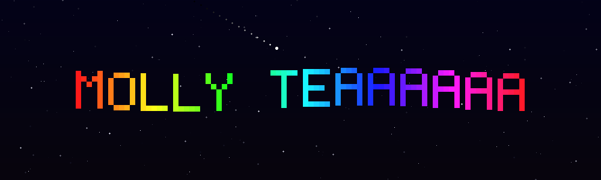

<!-- ===== Animated starfield banner ===== -->
<p align="center">
  
</p>

<!-- ===== Typing intro ===== -->
<p align="center">
  <a href="https://git.io/typing-svg"></a>
</p>

<p align="center">
  
</p>

<p align="center">
  <!--START_SECTION:time-->
  <b>Monday, 10 August 2026 &nbsp;·&nbsp; 09:55 AM · Sydney time</b>
  <!--END_SECTION:time-->
</p>

<!-- animated rainbow divider -->


## 📅 What I'm Up To

<!--START_SECTION:calendar-->
### 📅 Today · Monday 10 August (Sydney)

- 10:00am–3:30pm · 🎓 **UNI**
- 4:00pm–10:00pm · 💼 **WORK**

<sub>🔄 Updated 09:55 AM Sydney · via Google Calendar</sub>
<!--END_SECTION:calendar-->

<!-- animated rainbow divider -->


## 🧑‍💻 About Me

```python
class Jordan:
    def __init__(self):
        self.location    = "Sydney, Australia 🇦🇺"
        self.education   = "B. Information Technology @ UTS (full-time)"
        self.role        = "IT @ SocialBoothAU (full-time)"
        self.languages   = ["Java", "Python", "HTML"]
        self.focus       = ["cloud infra", "soc", "linux"]
        self.larp        = True
```


## 📊 GitHub Stats

<br>
<br>
<p align="center">
  
</p>
<!-- contribution snake (auto-generated by the Snake workflow) -->
<p align="center">
  
</p>


## 🎧 Now Playing

<p align="center">
  <a href="https://github.com/kittinan/spotify-github-profile">
    
  </a>
</p>


## 💭 Dev Quote

<p align="center">
  
</p>


## 🌐 Find Me Around the Web

<p align="center">
  <a href="https://www.instagram.com/j.owon/"></a>
  <a href="https://www.youtube.com/@ironbearturtle"></a>
  <a href="https://www.twitch.tv/ironbearturtle"></a>
</p>

<!-- ===== Waving footer ===== -->


<p align="center"><i>⭐️ Thanks for landing on my page ⭐️</i></p>
